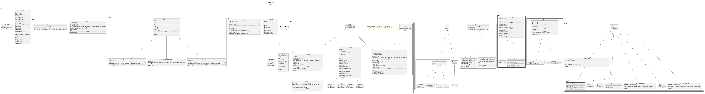
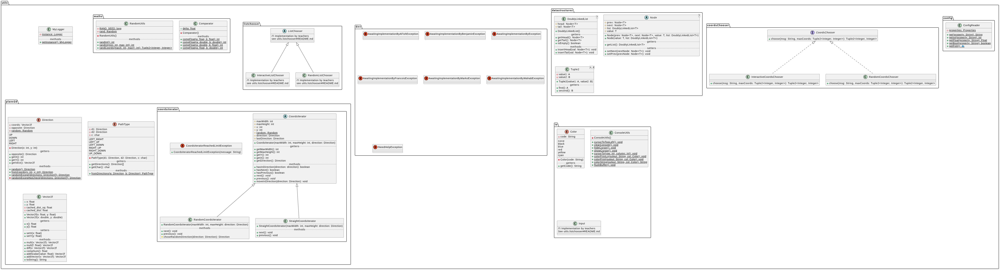
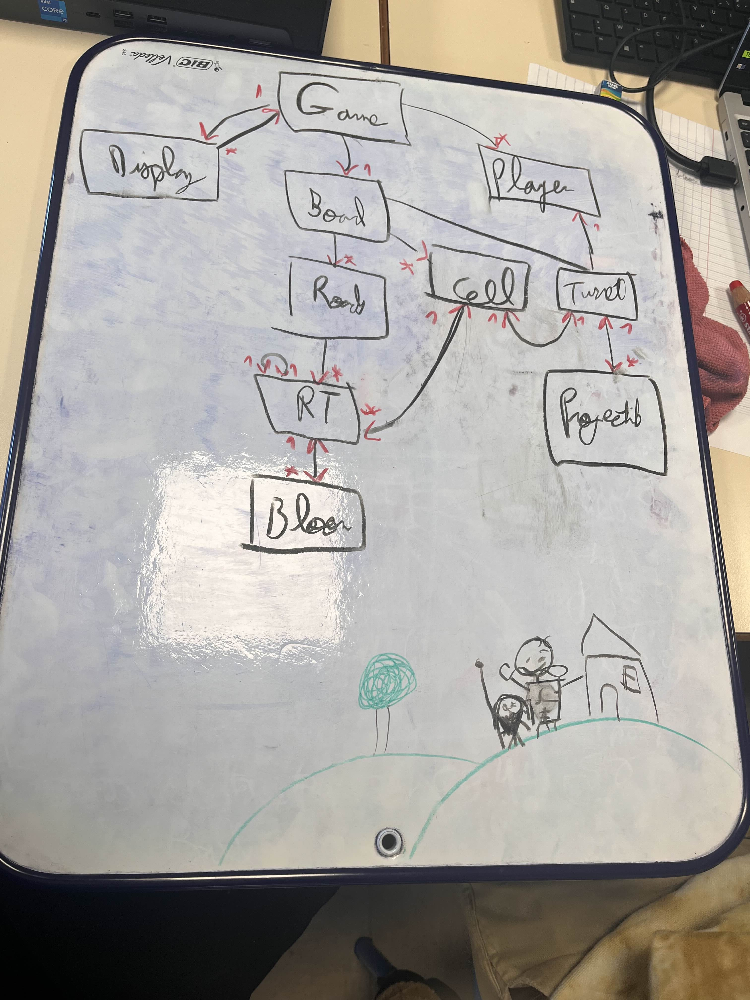
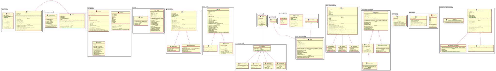

# l2s4-projet-2026

# Equipe 1

- Marko YANOVSKYI
- Mohamed Abdelouahab CHERIET
- François CAUS
- Benjamin BADINA

# Sujet

[Le sujet 2026](https://www.fil.univ-lille.fr/~varre/portail/l2s4-projet/sujet2026.pdf)

# Livrables

Les paragraphes concernant les livrables doivent être remplis avant la date de rendu du livrable. A chaque fois on décrira l'état du projet par rapport aux objectifs du livrable. Il est attendu un texte de plusieurs lignes qui explique la modélisation choisie, et/ou les algorithmes choisis et/ou les modifications apportées à la modélisation du livrable précédent.

Un lien vers une image de l'UML doit être fourni (une photo d'un diagramme UML fait à la main est suffisant).

## Livrable 1
La compilation/execution du livrable peut se faire via les commandes suivantes:
- nettoyage des répertoires: `make clean`
- compilation (projet + tests): `make compile`
- génération de la documentation: `make docs`
- lancement des tests: `make test`
- compression du projet en livrables .jar: `make livrables`
- execution des livrables .jar (arguments par défaut définis dans makefile): `make run`
### Conception du plateau:
- Classe "Board". Abstraite pour permettre l'implémentation de différents types de plateaux. Cette classe met a disposition des outils pour interagir avec un plateau, comme getCell (renvoie là cellule aux coordonnées x, y), getWidth/getHeight (renvoie la taille du plateau)
- Classe "DefaultBoard". Implémente le fonctionnement d'un plateau "normal" du jeu: une seule route, chaque ballon se déplace sur cette route et les tourelles ne peuvent pas être posés sur cette dernière.
- Classe "MultiPathBoard". Implémente le fonctionnement d'un plateau où les ballons n'ont pas un seul chemin commun mais plusieurs chemins rectilignes répartis sur le plateau. Ici les tourelles peuvent être posées partout.
### Conception des cellules
- Classe "Cell". Abstraite pour permettre l'implémentation de différents types de cellules. Met à disposition des outils pour interagir avec une cellule, comme getX/getY (renvoie les coordonnées), getBloons (liste des ballons présents sur cette cellule)
- Classe "RoadCell". Représente une cellule de type "road", où on ne peut pas placer de tourelle (cf. comportement de DefaultRoad)
- Classe "TurretCell". Cellule de type "tourelle", où on peut placer une tourelle. Il s'agit en réalité du type principal de cellules, puisque la majorité du plateau en est composé.
### Conception des routes
Les routes sont représentées par une classe indépendante, qui utilise une liste doublement chainée pour garder en mémoire dans l'ordre les cellules qui composent cette route
- Classe "Road". Encapsulation d'une liste doublement chainée (DoublyLinkedList). Garde aussi en mémoire un set de ses cellules pour un accès rapide.
- Classe "RoadTile". Représente un noeud de la liste chainée. Chaque noeud contient une cellule, la distance jusqu'a la fin du chemin, et un accès aux noeud précédents et suivants. Un ballon posé sur un chamin aura accès à la RoadTile correspondante, lui permettant de connaitre la prochaine cellule où se déplacer
- Classe "DoublyLinkedList". Implémentation d'une liste double chainée. Stocke une valeur de type générique (ici une Cell) dans un "Node". Dispose d'accesseurs pour lire/écrire dans la liste
- Classe "Node". Abstraite pour permettre la personnalisation du contenu de la liste. Ici on définit un accesseur pour la valeur nommé "getCell" plutôt qu'un simple "getValue" qui à moins de sens.
### Conception de l'agorithme de génération de route
- La génération de l'itinéraire repose sur deux classes, principalement ***CoordsIterator***. L'algorithme procède à rebours (de la fin vers le début) afin de définir facilement l'attribut « distance jusqu'à l'arrivée » pour chaque RoadTile.

- Le tracé remonte le plateau via deux fonctions : previous (ligne droite) et randomPrevious (chemin aléatoire). La prévention des demi-tours est gérée directement dans randomPrevious : l'objet mémorise la dernière direction empruntée et appelle la méthode statique ***Direction***.randomExcept. On passe à cette fonction une liste d'exclusions contenant la direction principale et l'opposé du dernier mouvement ; elle retourne alors une direction valide qui ne figure pas dans cette liste.

- L'ensemble de la logique est exécuté dans la méthode genRandPath de DefaultBoard. Chaque nouvelle tuile créée est ajoutée en tête d'une liste doublement chaînée (roads), qui est renvoyée une fois le bord opposé du direction prencipal(si la direction prencipale est RIGHT alors on atteint bord gauche) du plateau atteint.


### Atteinte des objectifs

### Difficultés restant à résoudre

## Livrable 2

### Atteinte des objectifs

### Difficultés restant à résoudre

## Livrable 3

### Atteinte des objectifs

### Difficultés restant à résoudre

## Livrable 4

### Atteinte des objectifs

### Difficultés restant à résoudre

## Livrable 5

### Atteinte des objectifs

### Difficultés restant à résoudre

## Livrable 6
### ! Prérequis
La présence de deux fichiers est nécessaire pour compiler et executer le projet:
- `.env` à la racine du projet, contenant une variable `JAVA_HOME` pointant le répertoire source des binaires java (généralement `/usr/bin/`). Cette configuration à pour objectif de permettre la compilation et execution du projet avec une version spécifique de java si besoin, ou d'éviter des problèmes en cas d'installation non standard de java. En l'absence de ce fichier, la version par défaut de java sera utilisée (commandes `java`, `javac` etc)
- `config.properties` également à la racine du projet, contenant toutes les informations sur le jeu comme le nombre de points de vie des tours ou leur vitesse. Ce fichier est fourni.
### Cibles `make`
- `clean` : nettoyer l'environnement des tous les fichiers temporaires ou compilés
- `docs` : compilation de la javadoc (résultat: [design/docs/index.html](design/doc/index.html))
- `classes` : compilation de toutes les classes du projet
- `tests` : compilation de toutes les classes de test
- `runtests` : execution via JUnit de tous les tests
- `jar` : compression du projet en fichiers `.jar`

### UML actuel

#### Game


#### Utils
> Les diagrammes ont été séparé en deux parties pour des raisons de lisibilité



### Atteinte des objectifs

### Difficultés restant à résoudre
De nombreux TODOs restent à régler dans l'entièreté du projet, de la documentation d'une méthode à de potentielles optimisations algorithmiques, en passant par des vérifications et du nettoyage de code obsolète.

# Journal de bord

Le journal de bord doit être rempli à la fin de chaque séance encadrée, et **avant** de quitter la salle.

Pour chaque semaine on y trouvera :
- ce qui a été réalisé, les difficultés rencontrées et comment elles ont été surmontées (on attend du contenu, pas uniquement une phrase du type "tous les objectifs ont été atteints")
- la liste des objectifs à réaliser d'ici à la prochaine séance encadrée

## Semaine 1

### Ce qui a été réalisé

- Ébauche du diagramme uml
- Réflexion des classes utilisées pour gérer:
    - Plateau
    - Ballons
    - Chemins
    - Cellules
- Réflexion sur l'algorithme de génération de chemin

### Difficultés rencontrées

- Organisation de l'hérédité entre cellules "bloons" et cellules "tourelles"

### Objectifs pour la semaine et répartition du travail par membre

- BADINA Benjamin
    - Mise au propre de l'uml
- CAUS François
    - Création de l'espace privé d'échange textuel et vocal intercommunicatif efficace

## Semaine 2

### Ce qui a été réalisé

Début de développement des classes: (non testé)
- Plateau
    - Board
    - DefaultBoard
    - MultiPathBoard
- Cellules (contenues dans le plateau)
    - Cell
    - RoadCell
    - TurretCell
- Ballons
    - Bloon
    - BlueBloon
    - RedBloon
- Projectiles
    - Projectile
- Turets
    -Turret
- Routes (testées)
    - Road
        Ajouter une cellule en tête
        Vérifier l'appartenance d'une cellule à la route
        Accesseurs de la liste chainée (head/tail)
        Accès à la longueur de la route via `getDistToEnd`, la distance entre la première cellule et l'arrivée
    - RoadTile
        Accesseurs pour la cellule stockée, la distance jusqu'a l'arrivée (voir Road), les noeuds précédents/suivants
        Test d'égalité (via test d'aglité des cellules stockées)
    - DoublyLinkedList
        Accesseurs head/tail
        Insertion en tête et en queue
        Test liste vide
    - Node
        Accesseurs des noeuds précédents/suivants (accès + re-définition)
- Affichage
    - Affichage simple d'un plateau
- CoordsIterator
    - Itération sur le board pour choisir les cellules nécessaires à la création de la route et pour définir les directions à écrire dans une cellule pour la future représentation graphique.
- Direction
    - Représentation de la direction via un Enum, utilisant les méthodes random et randomExcept pour choisir une direction.

### Difficultés rencontrées

### Objectifs pour la semaine et répartition du travail par membre

- François:
    - écrire les tests de Road/RoadTile
    - affichage basique d'un plateau (principalement pour débugger)
- CHERIET Mohamed Abdelouahab :
    - écrire les tests de Board/DefaultBoard/MultiPathBoard
    - écrire les test de Cell/RoadCell/TurretCell
    - Création d'une classe `Projectile ` dans le packtage `objects.projectiles`
    - Création d'une classe `Turrets ` dans le packtage `objects.turrets`

- BADINA Benjamin
    - Création des 2 classes Main
    - Création d'une classe généraliste `gameObject` dont les classes dans le package `objects` héritent
    - Création de méthode générale `canPlace(gameObject)` dans `Cell` au lieu de `canPlaceTurret()` et `canBloonPass()`
    - Création de méthode `getDirection()` dans `RoadTile`
    - Gestion de l'affichage des direction du plateau avec des caractères ascii ('┏', '━', ...)
- YANOVSKYI Marko
    - Création de méthode pour générer des multiples de routes tout droites
    - Création de tests pour classe CoordsIterator
    - écrire la documentation pour classe CoordsIterator et classe Direction
/!\
Il manque les accesseurs des coordonnées dans Cell.java
Visiblité (private/public/protected) des méthodes abstraites définies dans Board/DefaultBoard/MultiPathBoard à vérifier

## Semaine 3

### Ce qui a été réalisé

### Difficultés rencontrées

Boucle infinie à la création de DefaultBoard pour une taille de 1x1

### Objectifs pour la semaine et répartition du travail par membre

- François
    - Création d'un makefile
        - compile (compile le projet et les tests)
        - run (execute les livrables)
        - test (lance les tests junit)
        - clean (nettoie le répertoire de travail)
        - livrables (compresse les livrables en .jar)
        - unpack_libs (décompresse les librairies pour créer ensuite un .jar standalone)
    - Gestion du déplacement des ballons sur les routes
        - définition du trajet au sein d'une cellule (distance jusqu'au milieu/la sortie de la cellule)
        - passage d'une celluole à la suivante
    - affichage des ballons avec BasicDisplay
        - caractère 'o' repréentant 1+ ballon(s)
    - mise à jour du diagramme UML

## Semaine 4

### Objectifs pour la semaine et répartition du travail par membre

- mohamed abdelouahab
    - réorganiser les fichiers de projectiles
    - ecrire les tests de (BombeProjectile/SharpProjectileet ...ect)
- Benjamin
    - continuer game (main game loop)
    - algorithme de range de turret
    - réfléchir à projectile spawner
    - eventuellement display graphics
    - régler les problèmes de la doc
- François
    - Ajout d'un fichier de configuration (+classe associée)
    - mise à jour de l'algorithme de déplacement des bloons (get direction instantanée (Vector2f))
- Marko
    - déplacement des projectiles
    - range des projectiles

### Ce qui a été réalisé

- Benjamin
    - Écriture de `Game` (Constructeur, Ajout / Suppression de displays, création de la boucle principale, gestion des ticks)
- Marko
    - réalisé l'algo de recherche de bloons à portée afin que les tourelles puissent choisir leurs cibles, ainsi que pour les projectiles pour qu'ils puissent "voir" les bloons tout au tour. Ahouté quelques tests.

### Difficultés rencontrées

## Semaine 5

### Objectifs pour la semaine et répartition du travail par membre

### Ce qui a été réalisé

### Difficultés rencontrées

## Semaine 6

### Objectifs pour la semaine et répartition du travail par membre

### Ce qui a été réalisé

### Difficultés rencontrées

## Semaine 7

### Objectifs pour la semaine et répartition du travail par membre

François:
    - suppression et refactoring des classes "spawners"
    - refactoring des projectiles et turrets pour supprimer l'utilisation des spawners
    - refactoring des projectiles pour ajouter l'utilisation de "targetable"

### Ce qui a été réalisé

### Difficultés rencontrées

## Semaine 8

### Objectifs pour la semaine et répartition du travail par membre

### Ce qui a été réalisé

### Difficultés rencontrées

## Semaine 9

### Objectifs pour la semaine et répartition du travail par membre


- YANOVSKYI Marko
    - Écriture de `getBloonsInRange()` dans `Board`
- BADINA Benjamin
    - Ajout de tests
    - Gestion des Upgradeable
    - Wave
    - Documentation
- CAUS François
    - Vérifier le fonctionnement de tous les projectiles
- CHERIET Mohamed Abdelouahab
    - Gestion des Upgradeable
    - Ajout des Upgradeable dans l'interface graphique
    - Shop
    - livrable4b ( avec shop  et wave et vie et upgrade )

    

### Ce qui a été réalisé

- BADINA Benjamin
    - Implémentation de projectiles améliorables
    - Implémentation de système de manches dans `Game`. Une manche est terminée uniquement lorsque le plateau n'a plus de bloons
    - Refactor de l'architecture du code 
    - `Game` est maintenant une classe singleton accessible partout
    - Quelques bugfix
    - Livrable4a
- CHERIET Mohamed Abdelouahab
    - Gestion des Upgradeable
    - Ajout des Upgradeable dans l'interface graphique
    - Shop
    - livrable4b ( avec shop  et wave et vie et upgrade )
    - Ajout d’un affichage explicite pour les événements importants :
         - bloon touché bloon détruit,bloon ralenti,bloon arrêté,...
    - Création des nouvelles tours :
        - FreezeMonkey.java/SlowMonkey.java
    - Modification du Makefile pour faciliter l’exécution des livrables 4 ( pour lancer  le livrable4b : make run4b )
    - Modification de Projectile.java pour afficher les impacts avec un log plus clair
    - Correction de SlowProjectile.java pour que le projectile de ralentissement soit cohérent avec le reste du projet
    - Intégration de ces nouvelles tours dans les livrables(3) 


### Difficultés rencontrées

## Semaine 10

### Objectifs pour la semaine et répartition du travail par membre

- Classes:
    - (Benjamin) Ajout `UpgradableAttribute`
    - (Benjamin) Redesign du système d'`Upgrade` (Turrets)
    - (Benjamin) Modification `Player`
    - (Marko) implementation `Shop`
    - (François) `Action` actions que le joueur peut effectuer (addTurret, upgradeTurret, downgradeTurret...) + templates
        - display state
        - display turrets
        - buy turret
        - sell turret
        - upgrade turret
        - downgrade turret
        - next wave
        - exit
- (All) [Après `Action`] Simplification de la boucle principale (while running, get menu action and execute action)
    - (Wahab) mettre à jour tous les templates pour utiliser `Util.ConfigReader`


### Ce qui a été réalisé
   - (abdelouahab(wahab)) 
      - mettre à jour tous les templates pour utiliser `Util.ConfigReader`
      - remplir tout les property de config.properties 


### Difficultés rencontrées

## Semaine 11
 - (Abdelouahab ( Wahab)) 
    - boss  sur les wave et WaveGenerator  (   gerer  la diffculter  des bloon dans  chaque wave )
 - (François)
    - faire  tout le  UML  de  le projet  ( tout les details et les methodes  de chaque  class  dans le projet )
 - (Benjamin)
 - (Marko)

### Objectifs pour la semaine et répartition du travail par membre

### Ce qui a été réalisé

### Difficultés rencontrées
A particularily tough bug was found:
```
[bug]     /"*._         _
      .-*'`    `*-.._.-'/
    < * ))     ,       (
      `*-._`._(__.--*"`.\
```
## Semaine 12

### Objectifs pour la semaine et répartition du travail par membre
 - (Abdelouahab ( Wahab))
    -  travaille  sur les template des turret ActionBuy pour chaque turret 
 - Francois:
    - Réorganisation complète + implémentation des actions que le joueur peut effectuer
 - **Benjamin**
  - réalisation du livrable 5 ;
### Ce qui a été réalisé
- **Abdelouahab (Wahab)**
  - correction de `Livrable5.java` ;
  - mise en place de 10 waves ;
  - ajout du placement automatique de deux tours de chaque type via des actions ;
  - ajout de l’affichage des waves et des évolutions des tours ;
  - correction des actions d’upgrade/downgrade et du remboursement dans le shop.


- **Francois**:
    - Réorganisation complète + implémentation des actions que le joueur peut effectuer

- **Benjamin**
  - réalisation du livrable 5 ;

### Difficultés rencontrées

### UML actuelle



## Diaporama présentation

[lien](https://docs.google.com/presentation/d/1jNGUlMPuC8opBjHhoA-VT4dPu4kiL9Z2iYF447VMX3w/)